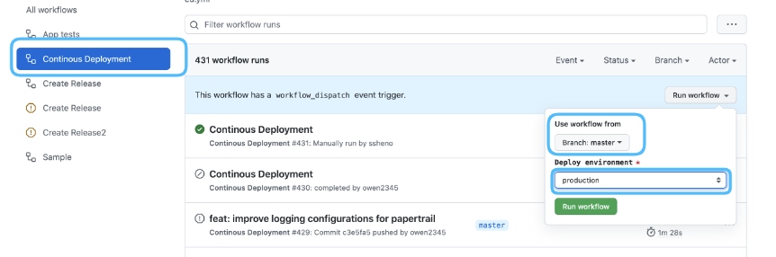

# shareable-github-workflows
This is a repository to host shareable github workflows for CI and CD for Ruby/Rails applications (can be used other languages too).

## Requirements
The workflows expect for a containerized application (docker-compose with `test` service) to run the corresponding actions, something like: 
`docker-compose run test /bin/sh -c "bundle exec rspec"`    
Check [this repo](https://github.com/owen2345/rails_app_containerization) to see how to containerize an existent rails application.

## Continuous Integration 
Features:   
- Run tests for every pull request in the application
```yaml
  name: App tests
  on:
    pull_request: # Run tests for every pull request

  jobs:
    app-tests:
      uses: owen2345/reusable-ci-cd-actions/.github/workflows/tests.yml@main
      with:
        copy_env: false # copy .env-example to .env (default true)
        debug: false # After all steps (success or failure) starts tmate session for debugging (default false)
        
        # backend
        copy_db_yml: true # copy config/database-example.yml to config/database.yml (default false)
        prepare_db_cmd: bundle exec rake db:setup # Initialize the database for the tests (default bundle exec rails db:setup)
        rspec_cmd: bundle exec rspec # Run application tests (default bundle exec rspec)
        run_rubocop: true # Run rubocop code style check (default true)

        # frontend
        frontend_tests_cmd: yarn test # Run frontend tests (default empty)
        eslint_cmd: yarn eslint # Run eslint code style check (default empty)

        # test coverages (requires simplecov configuration https://github.com/simplecov-ruby/simplecov)
        publish_coverage: false # Publish coverage report as an github action artifact (default false)
        min_coverage: 90 # Minimum coverage percentage required to pass the tests (default 90)
        codeclimate_key: "my-key" # Codeclimate API key used to publish coverage report to codeclimate (default empty)
```  

## Continuous Deployment
    
** Note: Continuous deployment process depends on `Kubernetes_helper` gem to run the corresponding deployment [(See documentation)](https://github.com/owen2345/kubernetes_helper)      
Features:    
- The ability to manually deploy any branch to any environment
  
- Run production deployment when merged changes into Master branch, such as release candidate, hotfix
- Run stating deployment when tests passed successfully on release candidate branches (`release/*`)
```yml
name: Continous Deployment
on:
  # triggered once "App tests" (tests.yml) successfully completed for any release (auto deploy to staging)
  workflow_run:
    workflows: [ "App tests" ]
    branches: [ "release/**" ]
    types:
      - completed

  # when release PR OR Hotfix was merged into master or main branch (auto deploy to production)
  push:
    branches:
      - main
      - master

  # manually deploy any branch to a specific environment
  workflow_dispatch:
    inputs:
      deploy_env:
        type: choice
        required: true
        default: 'beta'
        options:
          - beta
          - production
        description: 'Deploy environment'

jobs:
  continuoues-deployment:
    uses: owen2345/reusable-ci-cd-actions/.github/workflows/cd.yml@main
    secrets:
      PROD_GOOGLE_AUTH: ${{ secrets.PROD_GOOGLE_AUTH }}
      BETA_GOOGLE_AUTH: ${{ secrets.BETA_GOOGLE_AUTH }}
```

## Automatic release builder
Features:    
- Once merged into master branch, publish the corresponding release to github and the corresponding git tag to github.
- Ability to create manually release candidates with all changes as part of the PR description
  
Note: The new version (if not generated via "create manually release...") is auto calculated using the last git tag, for example if the current version is `1.0.1`, the new version will be `1.0.2`.   

```yaml
on:
  push: # Any pull request merged into master (hotfixes, releases or direct pushes) should publish the corresponding github release + git tag
    branches:
      - main
      - master

  workflow_dispatch: # Ability to create manually a new release candidate
    inputs:
      version_name:
        description: 'Release version name, sample: 1.0.0'
        required: true

name: Create Release

jobs:
  release-builder:
    uses: owen2345/reusable-ci-cd-actions/.github/workflows/release_builder.yml@main
    with:
      commit_mode: true # If true, then fetches all commit titles from all changes. If false, then fetches only the PR titles from all changes.
      create_release_pr: ${{ github.event.inputs && github.event.inputs.version_name || '' }}
```

## Release builder from git tags (ideal for ruby gems)
Once pushed a new git tag to github, creates the corresponding release on github with all changes list as the description of the release
Note: The new version is auto calculated using the last git tag, for example if the current version is `1.0.1`, the new version will be `1.0.2`.
```yml
name: Create release from tag
on:
  push:
    tags: # Create a release once a git tag is published
      - '*'

jobs:
  release-builder:
    uses: owen2345/reusable-ci-cd-actions/.github/workflows/release_builder_from_tag.yml@main
    with:
      commit_mode: true # If true, then fetches all commit titles from all changes. If false, then fetches only the PR titles from all changes.
```
